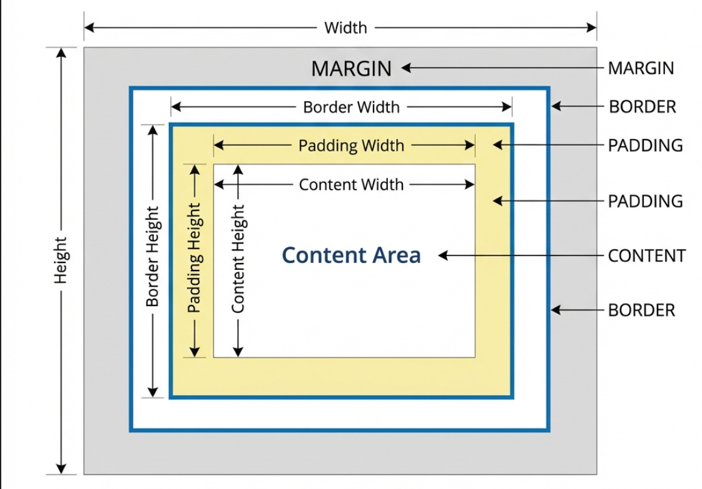

# Box Model - Understanding Element Dimensions


## What is the Box Model?

The CSS Box Model is a fundamental concept that describes how every HTML element is represented as a rectangular box. Each box consists of four areas:

1. **Content** - The actual content (text, images, etc.)
2. **Padding** - Space between content and border
3. **Border** - The edge around the padding
4. **Margin** - Space outside the border

Understanding the box model is crucial because it affects how elements are sized and spaced on the page.

### Why is the Box Model Important?

Before understanding the box model, developers struggled with unexpected element sizes and spacing. The box model helps by:
- **Predictable sizing** - Know exactly how big an element will be
- **Proper spacing** - Control space inside and outside elements
- **Layout control** - Build precise layouts
- **Debugging** - Understand why elements don't fit as expected

### Visual Box Model Diagram



The diagram above shows how each element is composed of four layers:
- **Margin** (outermost) - Transparent space outside the border
- **Border** - The edge around the padding
- **Padding** - Space between content and border (has background color)
- **Content** - The actual content area

## Box Model Properties - Quick Reference

| Property | Description | Example | Default |
|---|---|---|---|
| `width` | Content width | `width: 300px;` | `auto` |
| `height` | Content height | `height: 200px;` | `auto` |
| `padding` | Space inside border | `padding: 20px;` | `0` |
| `padding-top` | Top padding | `padding-top: 10px;` | `0` |
| `padding-right` | Right padding | `padding-right: 15px;` | `0` |
| `padding-bottom` | Bottom padding | `padding-bottom: 10px;` | `0` |
| `padding-left` | Left padding | `padding-left: 15px;` | `0` |
| `border` | Border shorthand | `border: 1px solid black;` | `none` |
| `border-width` | Border thickness | `border-width: 2px;` | `medium` |
| `border-style` | Border style | `border-style: solid;` | `none` |
| `border-color` | Border color | `border-color: red;` | `currentColor` |
| `margin` | Space outside border | `margin: 20px;` | `0` |
| `margin-top` | Top margin | `margin-top: 10px;` | `0` |
| `margin-right` | Right margin | `margin-right: 15px;` | `0` |
| `margin-bottom` | Bottom margin | `margin-bottom: 10px;` | `0` |
| `margin-left` | Left margin | `margin-left: 15px;` | `0` |
| `box-sizing` | How size is calculated | `box-sizing: border-box;` | `content-box` |

## Detailed Explanation

### 1. Content Area (width & height)

**What it does:**
The content area is where your actual content (text, images, etc.) appears. `width` and `height` control the size of this area.

**Syntax:**
```css
element {
    width: value;
    height: value;
}
```

**HTML Example:**
```html
<div class="box">Content goes here</div>
```

**CSS Example:**
```css
.box {
    width: 300px;
    height: 200px;
    background-color: lightblue;
}
```

**Result:** A light blue box that is 300px wide and 200px tall.

**Common values:**
- `px` - Fixed pixels: `width: 300px;`
- `%` - Percentage of parent: `width: 50%;`
- `auto` - Browser calculates: `width: auto;`
- `vw/vh` - Viewport units: `width: 50vw;`

**Real-world scenario:**
You want a sidebar to be exactly 250px wide regardless of screen size. Use `width: 250px;`.

---

### 2. Padding - Space Inside

**What it does:**
Padding creates space **between the content and the border**. It's inside the element and takes the element's background color.

**Syntax:**
```css
/* All sides */
padding: 20px;

/* Vertical | Horizontal */
padding: 10px 20px;

/* Top | Horizontal | Bottom */
padding: 10px 20px 15px;

/* Top | Right | Bottom | Left (clockwise) */
padding: 10px 15px 20px 25px;
```

**HTML Example:**
```html
<div class="padded-box">
    This text has space around it inside the box
</div>
```

**CSS Example 1 - Equal padding:**
```css
.padded-box {
    padding: 20px;
    background-color: #f0f0f0;
    border: 2px solid #333;
}
```

**Result:** 20px of space on all sides between the text and the border.

**CSS Example 2 - Different padding:**
```css
.button {
    padding: 10px 20px; /* 10px top/bottom, 20px left/right */
    background-color: #007bff;
    color: white;
    border: none;
}
```

**CSS Example 3 - Individual sides:**
```css
.card {
    padding-top: 20px;
    padding-right: 15px;
    padding-bottom: 20px;
    padding-left: 15px;
    background-color: white;
    border: 1px solid #ddd;
}
```

**When to use:**
- Creating breathing room inside elements
- Making buttons and cards more spacious
- Preventing text from touching borders

**Real-world scenario:**
You have a button with text that's touching the edges. Add `padding: 10px 20px;` to create space inside the button.

---

### 3. Border - The Edge

**What it does:**
The border is a line around the padding and content. It can have width, style, and color.

**Syntax:**
```css
/* Shorthand: width style color */
border: 2px solid black;

/* Individual properties */
border-width: 2px;
border-style: solid;
border-color: black;

/* Individual sides */
border-top: 1px solid red;
border-right: 2px dashed blue;
border-bottom: 3px dotted green;
border-left: 4px double orange;
```

**Border Styles:**
- `solid` - Solid line
- `dashed` - Dashed line
- `dotted` - Dotted line
- `double` - Double line
- `groove` - 3D grooved
- `ridge` - 3D ridged
- `inset` - 3D inset
- `outset` - 3D outset
- `none` - No border

**HTML Example:**
```html
<div class="bordered-box">Box with border</div>
```

**CSS Example 1 - Simple border:**
```css
.bordered-box {
    width: 200px;
    padding: 20px;
    border: 2px solid #333;
    background-color: white;
}
```

**CSS Example 2 - Different borders:**
```css
.fancy-border {
    border-top: 3px solid #007bff;
    border-right: 1px solid #ddd;
    border-bottom: 1px solid #ddd;
    border-left: 1px solid #ddd;
}
```

**CSS Example 3 - Rounded borders:**
```css
.rounded {
    border: 2px solid #007bff;
    border-radius: 8px; /* Rounds the corners */
    padding: 15px;
}
```

**When to use:**
- Visual separation between elements
- Creating cards and containers
- Highlighting active elements

**Real-world scenario:**
You want to create a card with a subtle border. Use `border: 1px solid #ddd;` for a light gray border.

---

### 4. Margin - Space Outside

**What it does:**
Margin creates space **outside the border**, between the element and other elements. Margins are transparent (don't have background color).

**Syntax:**
```css
/* All sides */
margin: 20px;

/* Vertical | Horizontal */
margin: 10px 20px;

/* Top | Horizontal | Bottom */
margin: 10px 20px 15px;

/* Top | Right | Bottom | Left (clockwise) */
margin: 10px 15px 20px 25px;

/* Centering */
margin: 0 auto;
```

**HTML Example:**
```html
<div class="box1">First Box</div>
<div class="box2">Second Box</div>
```

**CSS Example 1 - Space between elements:**
```css
.box1 {
    margin-bottom: 20px;
    padding: 15px;
    background-color: lightblue;
}

.box2 {
    padding: 15px;
    background-color: lightgreen;
}
```

**Result:** 20px of space between the two boxes.

**CSS Example 2 - Centering:**
```css
.centered-box {
    width: 600px;
    margin: 0 auto; /* Centers horizontally */
    padding: 20px;
    background-color: #f0f0f0;
}
```

**CSS Example 3 - Negative margin:**
```css
.overlap {
    margin-top: -10px; /* Pulls element up */
    padding: 15px;
    background-color: white;
    border: 1px solid #ddd;
}
```

**Margin Collapse:**
When two vertical margins meet, they collapse into a single margin (the larger one).

```html
<div class="top-box">Top</div>
<div class="bottom-box">Bottom</div>
```

```css
.top-box {
    margin-bottom: 30px; /* This wins */
}

.bottom-box {
    margin-top: 20px; /* Ignored */
}
/* Actual space between: 30px, not 50px */
```

**When to use:**
- Creating space between elements
- Centering elements horizontally
- Pushing elements away from edges

**Real-world scenario:**
You want to center a container on the page. Set a fixed width and use `margin: 0 auto;`.

---

### 5. box-sizing Property

**What it does:**
Controls how the total width and height of an element is calculated.

**Values:**
- `content-box` (default) - width/height applies to content only
- `border-box` - width/height includes padding and border

**Syntax:**
```css
box-sizing: content-box | border-box;
```

**HTML Example:**
```html
<div class="content-box">Content Box</div>
<div class="border-box">Border Box</div>
```

**CSS Example - Comparison:**
```css
.content-box {
    box-sizing: content-box;
    width: 200px;
    padding: 20px;
    border: 5px solid black;
    /* Total width: 200 + 40 (padding) + 10 (border) = 250px */
}

.border-box {
    box-sizing: border-box;
    width: 200px;
    padding: 20px;
    border: 5px solid black;
    /* Total width: 200px (includes padding and border) */
}
```

**Best Practice - Global border-box:**
```css
* {
    box-sizing: border-box;
}
```

**Why border-box is better:**
- More intuitive sizing
- Easier calculations
- Padding doesn't break layouts
- Industry standard

**Real-world scenario:**
You set a div to `width: 50%` and add `padding: 20px`. With `content-box`, it overflows the parent. With `border-box`, it stays at 50%.

## Box Model Calculation Examples

### Example 1: content-box (default)

```css
.box {
    box-sizing: content-box;
    width: 300px;
    padding: 20px;
    border: 5px solid black;
    margin: 10px;
}
```

**Calculations:**
- Content width: 300px
- Padding: 20px × 2 = 40px
- Border: 5px × 2 = 10px
- **Total element width:** 300 + 40 + 10 = **350px**
- **Space taken (with margin):** 350 + 20 = **370px**

---

### Example 2: border-box

```css
.box {
    box-sizing: border-box;
    width: 300px;
    padding: 20px;
    border: 5px solid black;
    margin: 10px;
}
```

**Calculations:**
- Total element width: 300px (includes padding and border)
- Content width: 300 - 40 (padding) - 10 (border) = 250px
- **Total element width:** **300px**
- **Space taken (with margin):** 300 + 20 = **320px**

## Common Patterns

### Pattern 1: Card Component

```html
<div class="card">
    <h3>Card Title</h3>
    <p>Card content goes here</p>
</div>
```

```css
.card {
    width: 300px;
    padding: 20px;
    margin: 20px;
    border: 1px solid #ddd;
    border-radius: 8px;
    background-color: white;
    box-shadow: 0 2px 4px rgba(0,0,0,0.1);
    box-sizing: border-box;
}
```

---

### Pattern 2: Centered Container

```html
<div class="container">
    <h1>Page Content</h1>
    <p>Centered on the page</p>
</div>
```

```css
.container {
    max-width: 1200px;
    margin: 0 auto;
    padding: 0 20px;
    box-sizing: border-box;
}
```

---

### Pattern 3: Button

```html
<button class="btn">Click Me</button>
```

```css
.btn {
    padding: 12px 24px;
    border: 2px solid #007bff;
    border-radius: 4px;
    background-color: #007bff;
    color: white;
    cursor: pointer;
    box-sizing: border-box;
}

.btn:hover {
    background-color: #0056b3;
    border-color: #0056b3;
}
```

## Debugging the Box Model

**Browser DevTools:**
1. Right-click element → Inspect
2. Look at the "Box Model" diagram
3. See exact values for margin, border, padding, content

**Visual debugging:**
```css
* {
    outline: 1px solid red; /* Shows all element boundaries */
}
```

## Related Topics

- [[15-Borders|Borders]] - Border styles and properties
- [[07-Position-Property|Position]] - Element positioning
- [[08-Flexbox|Flexbox]] - Flexible layouts

---

