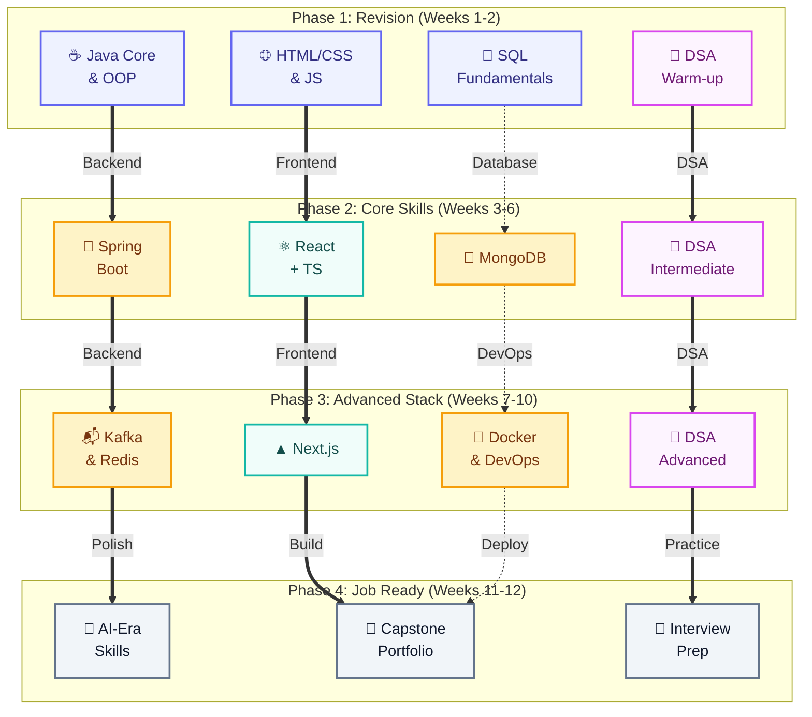

# Fullstack Java Developer Roadmap

A **12-week parallel learning roadmap** designed to get you an entry-level fullstack Java developer job in the AI era. No sequential slogging — learn **2–3 tracks simultaneously** so you stay engaged and never get bored.

## Why Parallel Learning?

Traditional roadmaps make you finish one skill before starting another. That's a recipe for boredom and burnout. Instead, this roadmap splits every phase into **parallel tracks** — work on backend in the morning, frontend in the afternoon, and DSA in the evening. You see connections early and stay motivated.

## Timeline Overview

| Phase | Weeks | Focus | Type |
|-------|-------|-------|------|
| [Phase 1](/docs/roadmap/phase-1) | 1–2 | Java, HTML/CSS/JS, SQL, DSA Basics | 🔄 Revision |
| [Phase 2](/docs/roadmap/phase-2) | 3–6 | Spring Boot, React + TS, MongoDB, DSA | 🆕 New Skills |
| [Phase 3](/docs/roadmap/phase-3) | 7–10 | Next.js, Kafka, Redis, Docker, DSA | 🆕 Advanced |
| [Phase 4](/docs/roadmap/phase-4) | 11–12 | AI Skills, Portfolio, Interview Prep | 💼 Job Ready |

## Complete Skill Coverage

| Category | Skills |
|----------|--------|
| 🔄 Revision | Java, HTML5, CSS3, JavaScript (ES6+), SQL |
| 🆕 Frontend | TypeScript, React.js, Next.js, Tailwind CSS |
| 🆕 Backend | Spring Boot, Spring Security, Spring Data JPA, REST APIs |
| 🆕 Databases | MongoDB, Redis (cache layer) |
| 🆕 Messaging | Apache Kafka |
| 🆕 DevOps | Git (advanced), Docker, Docker Compose, CI/CD (GitHub Actions) |
| 🆕 Cloud | AWS / GCP basics (deploy) |
| 🆕 Testing | JUnit 5, Mockito, Integration Testing |
| 🆕 Architecture | Microservices, System Design, Design Patterns |
| 🆕 AI-Era | LLM API integration, Spring AI, Prompt Engineering |
| 🧠 DSA | Arrays, Strings, Linked Lists, Trees, Graphs, DP, Heaps, Tries |
| 💼 Job Prep | Resume, Mock Interviews, Behavioral |

## How to Use

1. **Start with Phase 1** — revise your foundations (you already know these)
2. **Work on ALL tracks within each phase simultaneously** — switch tracks when bored
3. **Check off items** as you complete them
4. **Move to next phase** after completing 80%+ of current phase
5. **Build projects** at the end of each phase to solidify learning

## Quick Links

- [Daily Schedule Template](/docs/roadmap/daily-schedule) — how to structure your day
- [Resources & Tools](/docs/roadmap/resources) — recommended learning materials for every skill
